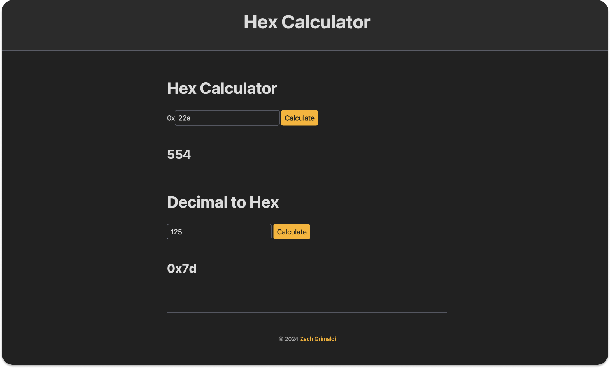

# hex-calculator

Site for converting hexadecimal to decimal numbers, and vice versa. Maybe more similar tools in the future.

Visit: https://hex-calculator.pages.dev/

This project is hosted on Cloudflare Pages, and is kept in just one file [`public/index.html`](public/index.html). Nothing but HTML and inline `<script>` tags for the client-side JavaScript code to do the conversions.
<br><br>



## Tools Used

-   ⚡️ [Cloudflare Pages](https://pages.cloudflare.com/) for static site hosting.
-   ⛅️ [Wrangler CLI](https://developers.cloudflare.com/workers/wrangler/install-and-update/) for deploying to Cloudflare Pages.
-   🎨 [Simple.css](https://simplecss.org/) for lightweight styling.

## Commands

To deploy the project, run:

```
npx wrangler pages deploy public/
```

## Changelog

| Date       | Version | Description                                                |
| ---------- | ------- | ---------------------------------------------------------- |
| 2024-12-31 | 1.1.0   | Migrate to Cloudflare Pages, a better fit our static site. |
| 2024-12-08 | 1.0.0   | Initial release of MVP to Cloudflare Workers.              |
